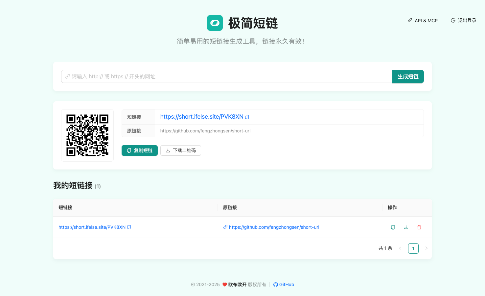
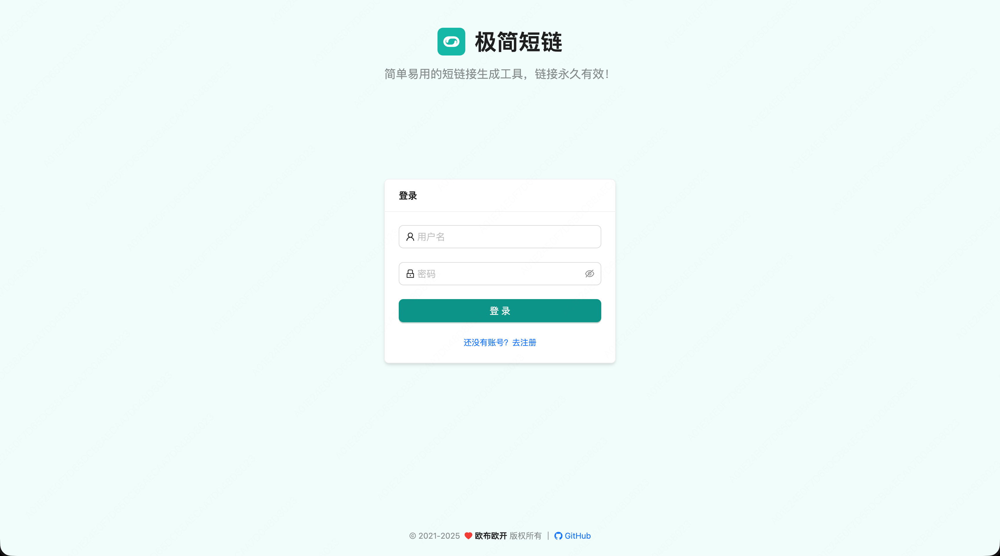
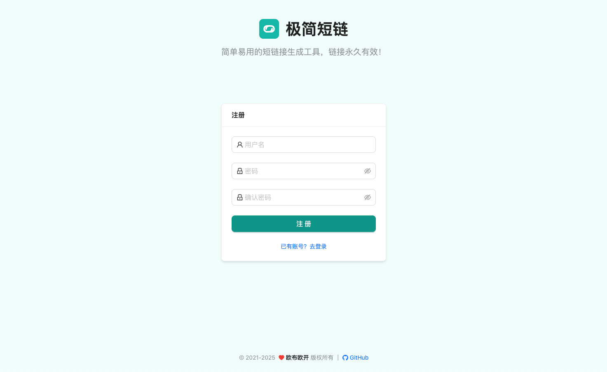

<p align="center">
  <a href="https://short.ifelse.site/">
    
  </a>

  <h1 align="center">极简短链</h1>
  <p align="center">
    将长链接转为短链接的小工具，完全开源、免费、支持注册登录，可私有化部署，短链接可永久有效。
  </p>
  <p align="center">
    
    
    
    
    
    
  </p>
  <p align="center">
    <a href="https://short.ifelse.site">体验地址</a>
    ·
    <a href="https://github.com/fengzhongsen/short-url/issues">报告Bug</a>
    ·
    <a href="https://github.com/fengzhongsen/short-url/issues">提出新特性</a>
  </p>
</p>

## 申明

该项目起初 Fork 自 [onee-io/short-url](https://github.com/onee-io/short-url) ，在工程方面进行了全面重构（采用 Monorepo 结构），UI 基于 Antd6 重写，同时增加了注册/登录/登出等能力，短链生成算法也采用了业界最佳实践，并增加了 MCP (Model Context Protocol) 服务支持。

## 项目结构

本项目采用 Monorepo 结构管理：

- `packages/short-client`: 前端项目 (React + Antd)
- `packages/short-server`: 后端服务 (Express + Redis)
- `packages/short-mcp-server`: MCP 服务 (用于 AI 助手集成)

## 效果演示


<details>
<summary>登录注册页面展示</summary>
<strong>登录</strong>

<strong>注册</strong>

</details>

## 环境依赖

- NodeJS 16+
- Redis 5+

## 环境变量

将 `.env.example` 文件重命名为 `.env`，并按你的 Redis 实际情况填写好配置信息，说明如下：

| 配置           | 默认值                  | 说明                          |
| -------------- | ----------------------- | ----------------------------- |
| PORT           | 3001                    | 服务端口                      |
| REDIS_HOST     | 127.0.0.1               | Redis 服务 IP 地址，支持 IPv6 |
| REDIS_PORT     | 6379                    | Redis 服务端口                |
| REDIS_USERNAME |                         | 用户名，没有留空即可          |
| REDIS_PASSWORD |                         | 密码，没有留空即可            |
| JWT_SECRET     | 'short-url-jwt-secret'  | JWT 密钥                      |
| JWT_EXPIRES_IN | '2h'                    | JWT 过期时间                  |
| ENCRYPT_KEY    | 'short-url-encrypt-key' | 密码加密密钥                  |
| USER_URL_LIMIT | 10                      | 用户生成短链接数量限制        |

## 调试

```bash
# 安装所有依赖 (根目录)
npm install

# 一键启动前后端服务 (并发启动)
npm start

# 或者分别启动:

# 仅启动后端服务 (端口 3001)
npm run start:server

# 仅启动前端服务 (端口 3000)
npm run start:client
```

## 部署

### 方式一：Docker 部署 (推荐)

```bash
docker compose up -d --build
```

### 方式二：手动部署

```bash
# 安装依赖
npm install

# 构建前端静态资源
npm run build:client

# 启动后端服务 (会自动托管前端构建产物)
npm run start:server
```

## MCP 服务集成

本项目提供了 MCP (Model Context Protocol) Server，允许 AI 助手（如 Claude Desktop, VS Code + Cline 等）直接调用你的短链服务生成短链接。

### Claude Desktop 配置

编辑 `claude_desktop_config.json`:

```json
{
  "mcpServers": {
    "short-url": {
      "command": "npx",
      "args": ["-y", "short-mcp-server"],
      "env": {
        "API_ORIGIN": "http://localhost:3001",
        "API_KEY": "YOUR_API_KEY"
      }
    }
  }
}
```

### VS Code 配置

编辑 VS Code `settings.json`:

```json
{
  "mcp.servers": {
    "short-url": {
      "command": "npx",
      "args": ["-y", "short-mcp-server"],
      "env": {
        "API_ORIGIN": "http://localhost:3001",
        "API_KEY": "YOUR_API_KEY"
      }
    }
  }
}
```

> 注意：请将 `YOUR_API_KEY` 替换为你登录系统后生成的 API Key。如果部署在公网，请将 `API_ORIGIN` 替换为实际域名。
